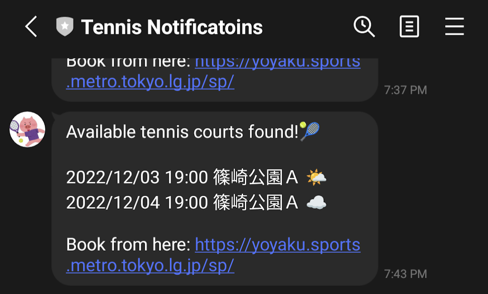

# What is this project for?
This project is to create a collection of services to help book tennis courts in Tokyo where there are far less tennis courts than enough. 

# System Overview

## System Architecture (TO BE)

# Court Application Status Check Serive
WIP

# Court Availability Check Service
This service executes its task regularly to check court availabilities on weekends. Courts on weekends are mostly booked by the raffles mentioned above, but there are quite a few last minute cancels. This service checks if there are any cancels and when it finds any available courts, it sends notifications through LINE.

## Notifications
This is what the notifications look like:

## How to run the service locally

Requirements: Docker (Tesed with version 30.10.12)

Steps:
1. Put necessary info in `availability_check/config.py`.
2. Run `docker-compose build` under the `availability_check` directory.
3. Run `docker-compose run` under the `availability_check` directory.

